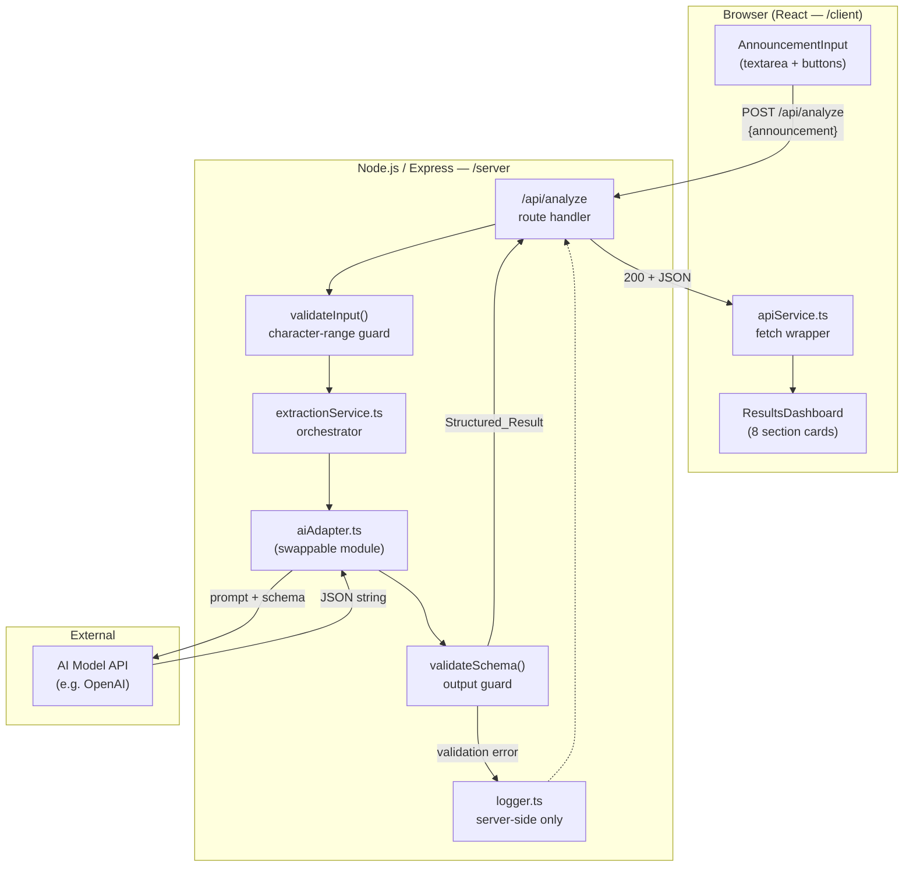

# Design Document: Campus Action — College Announcement Action Extractor

## Overview

Campus Action is a full-stack web application that accepts raw college announcement text and uses an AI model to extract a structured, actionable summary. The extracted information is rendered in a sectioned dashboard so students can quickly understand what changed, who is affected, what they must do, and when.

The application is built as a monorepo with a React frontend (`/client`) and a Node.js/Express backend (`/server`). The backend owns all AI communication through a swappable adapter module, ensuring that credentials never reach the browser and that the AI provider can be changed with a single module swap.

### Goals

- Convert unstructured announcement text into a validated JSON structure without hallucination.
- Keep all AI credentials strictly on the server.
- Provide clear loading, error, and empty states so students always know what the app is doing.
- Be responsive (375 px–1440 px), keyboard-navigable, and WCAG 2.1 AA compliant.
- Support automated Kiro Agent Hook analysis of `.txt` files placed in `/announcements/`.

---

## Architecture



### Key Architectural Decisions

| Decision | Choice | Rationale |
|---|---|---|
| Separate client/server | Monorepo, two separate package roots | Prevents any accidental bundling of server env vars into browser code |
| AI adapter pattern | Single `aiAdapter.ts` with a defined function signature | Swap providers by replacing one file; no other file changes needed |
| Schema validation layer | Explicit field-by-field check after AI response | Prevents malformed AI output from crashing the frontend |
| Error sanitization | Server maps all internal errors to safe HTTP responses | API keys and stack traces never leave the server |
| 30-second timeout | Enforced on both client (`AbortController`) and server (`axios` timeout) | Defense-in-depth; neither side hangs indefinitely |

---

## Components and Interfaces

### Frontend Components (`/client/src`)

```
App.tsx
├── Header.tsx                  — app name, subtitle
├── AnnouncementInput.tsx       — textarea, char counter, action buttons
│   └── CharCounter.tsx         — live "N / 10,000" display
└── ResultsDashboard.tsx        — rendered after successful extraction
    ├── PriorityBadge.tsx       — icon + label + color badge
    ├── SectionCard.tsx         — reusable card wrapper for each section
    ├── ActionChecklist.tsx     — ☐-prefixed action items
    ├── DateCard.tsx            — date + event + status per importantDates entry
    └── MissingInfoSection.tsx  — conditionally rendered missing info list
```

#### `AnnouncementInput` props

```typescript
interface AnnouncementInputProps {
  onSubmit: (announcement: string) => void;
  onClear: () => void;
  isLoading: boolean;
}
```

#### `ResultsDashboard` props

```typescript
interface ResultsDashboardProps {
  result: StructuredResult | null;
  error: AppError | null;
  isLoading: boolean;
}
```

#### `PriorityBadge` props

```typescript
interface PriorityBadgeProps {
  priority: "Urgent" | "Important" | "Informational";
}
// Renders: icon (⚠️ / 📌 / ℹ️) + label text + background color
// Color is NOT the only differentiator — icon and label always present
```

### Frontend Services (`/client/src/services`)

#### `apiService.ts`

```typescript
interface AnalyzeRequest {
  announcement: string;
}

interface AnalyzeResponse {
  result: StructuredResult;
}

// Wraps fetch with a 30-second AbortController timeout.
// Throws typed AppError on non-2xx responses or network failure.
async function analyzeAnnouncement(req: AnalyzeRequest): Promise<AnalyzeResponse>
```

#### `sampleAnnouncement.ts`

```typescript
// Hardcoded string, 150–800 characters, satisfying Requirement 11.1.
// Exported as a plain const — no runtime dependency.
export const SAMPLE_ANNOUNCEMENT: string
```

### Backend Modules (`/server/src`)

#### Route: `routes/analyze.ts`

- Accepts `POST /api/analyze`
- Delegates to `validateInput()` → `extractionService.analyze()` → `validateSchema()`
- Maps all thrown errors to safe HTTP responses (see Error Handling section)

#### `services/extractionService.ts`

```typescript
interface ExtractionService {
  analyze(announcement: string): Promise<StructuredResult>;
}
// Calls aiAdapter.complete(), then validateSchema() on the raw response.
// Throws ExtractionError on schema mismatch or AI failure.
```

#### `adapters/aiAdapter.ts` — **The swappable module**

```typescript
// This is the ONLY file that changes when switching AI providers.
interface AIAdapter {
  complete(prompt: string): Promise<string>;
}

// Current implementation wraps OpenAI Chat Completions (or any OpenAI-compatible API).
// Reads: AI_PROVIDER_ENDPOINT, AI_MODEL_NAME, AI_API_KEY from process.env.
// Applies a 30-second request timeout.
```

Swapping to a different provider (e.g., Anthropic) requires only providing a new `aiAdapter.ts` that exports a function with the same `complete(prompt: string): Promise<string>` signature.

#### `utils/validateInput.ts`

```typescript
// Returns void or throws InputValidationError.
function validateInput(announcement: unknown): void
// Rules: must be a non-empty string, length 20–10,000 characters.
```

#### `utils/validateSchema.ts`

```typescript
// Returns StructuredResult or throws SchemaValidationError.
// Checks: all 9 required fields present, correct types (arrays vs strings).
function validateSchema(raw: unknown): StructuredResult
```

#### `utils/logger.ts`

```typescript
// Server-side only. Logs to stdout/file. NEVER used in HTTP response bodies.
function logError(context: string, detail: unknown): void
```

---

## Data Models

### Output Schema — `StructuredResult`

```typescript
interface DateEntry {
  date: string;          // e.g. "November 15, 2025"
  event: string;         // associated event description
  status?: string;       // e.g. "Deadline", "Registration opens"
}

interface StructuredResult {
  summary:              string;       // one-paragraph executive summary
  whatChanged:          string[];     // list of changes described in announcement
  whoIsAffected:        string[];     // affected student groups / roles
  importantDates:       DateEntry[];  // all dates with event + status
  requiredActions:      string[];     // student must-do items only
  exceptions:           string[];     // exemptions / exclusion conditions
  documentsOrMaterials: string[];     // IDs, forms, files students must bring/submit
  priority:             "Urgent" | "Important" | "Informational";
  missingInformation:   string[];     // ambiguous / unstated info flagged
}
```

### API Request / Response Shapes

**Request**
```typescript
// POST /api/analyze
// Content-Type: application/json
interface AnalyzeRequestBody {
  announcement: string;   // 20–10,000 characters
}
```

**Success Response — HTTP 200**
```typescript
interface AnalyzeSuccessResponse {
  result: StructuredResult;
}
```

**Error Response — all error codes**
```typescript
interface AnalyzeErrorResponse {
  error: string;    // human-readable message, NO internal details
}
```

### HTTP Status Code Map

| Scenario | HTTP Code |
|---|---|
| Successful extraction | 200 |
| Missing / empty `announcement` field | 400 |
| Announcement out of 20–10,000 char range | 400 |
| AI response missing required fields or wrong types | 500 |
| AI response is not valid JSON | 500 |
| AI model unreachable / network error | 502 |
| AI rate limit exceeded | 429 |
| Extraction_Service timeout (>30 s) | 503 |

### AI Prompt Template

The prompt sent to the AI model includes:
1. A persona instruction ("You are a structured data extractor for college announcements.")
2. The output schema (JSON with field names, types, and descriptions).
3. Strict hallucination-prevention instructions (extract only what is explicitly stated; use "Not mentioned in the announcement." for missing fields).
4. The raw announcement text.
5. An instruction to return **only** the JSON object with no surrounding prose.

---

## Correctness Properties

*A property is a characteristic or behavior that should hold true across all valid executions of a system — essentially, a formal statement about what the system should do. Properties serve as the bridge between human-readable specifications and machine-verifiable correctness guarantees.*

### Property 1: Input validation rejects all non-conforming announcements

*For any* string that is either empty, composed entirely of whitespace, shorter than 20 characters, or longer than 10,000 characters, the backend `validateInput()` function SHALL return an error and SHALL NOT forward the string to the Extraction_Service.

**Validates: Requirements 2.3, 2.4, 4.7**

---

### Property 2: Schema validation rejects any AI response missing a required field

*For any* JSON object that is missing one or more of the nine required fields (`summary`, `whatChanged`, `whoIsAffected`, `importantDates`, `requiredActions`, `exceptions`, `documentsOrMaterials`, `priority`, `missingInformation`), the `validateSchema()` function SHALL throw a `SchemaValidationError` and SHALL NOT return a `StructuredResult`.

**Validates: Requirements 5.1, 5.2, 5.6**

---

### Property 3: Schema validation rejects type mismatches

*For any* AI response where a field that is defined as an array (`whatChanged`, `whoIsAffected`, `importantDates`, `requiredActions`, `exceptions`, `documentsOrMaterials`, `missingInformation`) contains a non-array value, `validateSchema()` SHALL throw a `SchemaValidationError`.

**Validates: Requirements 5.1, 5.6**

---

### Property 4: Priority classification covers all valid announcements

*For any* valid `StructuredResult`, the `priority` field SHALL be exactly one of `"Urgent"`, `"Important"`, or `"Informational"` — no other value is accepted by `validateSchema()`.

**Validates: Requirements 3.6, 5.1**

---

### Property 5: Error responses contain no internal details

*For any* error thrown during request processing (input validation error, schema validation error, AI network error, AI rate-limit error), the HTTP response body sent to the client SHALL contain only the `error` string field and SHALL NOT include any field containing the API key, a stack trace, or raw AI model output.

**Validates: Requirements 2.6, 5.2, 5.3, 7.8**

---

### Property 6: Character counter reflects input length

*For any* string entered into the announcement textarea, the displayed character counter value SHALL equal the `.length` of that string, and SHALL remain ≤ 10,000 (additional input is blocked at the limit).

**Validates: Requirements 1.3, 1.9**

---

### Property 7: Results dashboard renders all eight sections for any valid result

*For any* `StructuredResult` passed to `ResultsDashboard`, all eight section cards SHALL be present in the rendered output in the specified order (Executive Summary, What Changed, Who Is Affected, Important Dates, Required Actions, Exceptions / Exemptions, Documents / Materials, Missing Information — with Missing Information hidden only when `missingInformation` is empty).

**Validates: Requirements 6.1, 6.6**

---

### Property 8: Required actions rendered as checklist items

*For any* `StructuredResult` where `requiredActions` is non-empty, every item in that array SHALL be rendered with a `☐` prefix in the `ActionChecklist` component; when `requiredActions` is empty, a "No actions required" placeholder SHALL be rendered instead.

**Validates: Requirements 6.2, 6.8**

---

### Property 9: Date cards render all date entries

*For any* `StructuredResult` where `importantDates` is non-empty, every `DateEntry` SHALL be rendered as a `DateCard` showing the `date`, `event`, and `status` values; when `importantDates` is empty, a "No important dates identified" placeholder SHALL be rendered instead.

**Validates: Requirements 6.3**

---

### Property 10: Serialization round-trip preserves StructuredResult

*For any* valid `StructuredResult` object, `JSON.parse(JSON.stringify(result))` SHALL produce an object that passes `validateSchema()` and is deep-equal to the original.

**Validates: Requirements 5.1, 3.2**

---

## Error Handling

### Server-Side Strategy

```
Request received
  └─ validateInput() fails → 400, safe message, no logging needed
  └─ aiAdapter.complete() throws:
        NetworkError     → log internally → 502, safe message
        TimeoutError     → log internally → 503, safe message
        RateLimitError   → log internally → 429, safe message
  └─ validateSchema() fails:
        MissingFields    → log field names + timestamp → 500, safe message
        InvalidJSON      → log raw response + timestamp → 500, safe message
        TypeMismatch     → log field name + timestamp  → 500, safe message
```

All server error handlers follow one rule: **map to a safe string before writing to `res.json()`**. The `logger.ts` module is the only place that sees raw errors; nothing from `logger.ts` flows to the HTTP response.

### Client-Side Strategy

```
fetch() called with 30-second AbortController
  └─ AbortError (timeout) → "Request timed out. Please try again."
  └─ TypeError (network) → "Could not connect. Check your connection and retry."
  └─ HTTP 400 → show validation message from response body
  └─ HTTP 429 → "Request limit reached. Please try again later."
  └─ HTTP 500 / 502 → "Analysis could not be completed. Please try again."
  └─ HTTP 503 → "Service temporarily unavailable. Please try again."
```

The client never renders `error.stack`, `error.message` from the raw `Error` object, or any field not explicitly expected by the `AnalyzeErrorResponse` type.

---

## Testing Strategy

The testing approach uses two complementary layers:

- **Unit tests** — pure functions (input validation, schema validation, prompt building, component rendering) with specific examples and edge cases.
- **Property-based tests** — universal properties that hold across all valid inputs, implemented using a property-based testing library (e.g., `fast-check` for TypeScript/JavaScript). Each property-based test runs a minimum of 100 iterations.

### Property-Based Test Configuration

Each property test is tagged:

```
// Feature: campus-action-extractor, Property N: <property text>
```

Minimum 100 iterations per test.

### Test Coverage Map (Requirement 12 scenarios)

| Req 12 Criterion | Test type | What is tested |
|---|---|---|
| 12.1 — Multiple deadlines, all dates in `importantDates` | Property (P10 + P9) | For any valid result, all `importantDates` entries render as DateCards |
| 12.2 — Schedule change in `whatChanged` | Unit | Specific announcement → `whatChanged` populated |
| 12.3 — Exemption in `exceptions` | Unit | Specific announcement with exemption → `exceptions` populated |
| 12.4 — Multiple student groups in `whoIsAffected` | Property (P7) | For any valid result, all `whoIsAffected` entries appear in dashboard |
| 12.5 — No deadline → no invented dates | Unit | Announcement with no dates → `importantDates` is `[]` or contains "not mentioned" |
| 12.6 — No required action → no invented actions | Unit + P8 | Announcement with no actions → placeholder rendered |
| 12.7 — Optional suggestions not labeled mandatory | Unit | Announcement with "should" language → `requiredActions` not populated |
| 12.8 — Empty input → HTTP 400 | Unit (P1) | `validateInput("")` throws; route returns 400 |
| 12.9 — Invalid AI response → HTTP 500, no internals | Unit (P5) | Mocked malformed AI response → 500, body has no stack trace |
| 12.10 — 2000-char announcement, all fields populated | Integration | Long realistic announcement → every field non-null, non-empty |

### Unit Test Files

```
/server/src/__tests__/
  validateInput.test.ts       — empty, whitespace, too-short, too-long, valid
  validateSchema.test.ts      — missing fields, type mismatches, valid schema
  extractionService.test.ts   — mocked aiAdapter, schema pass/fail scenarios
  analyze.route.test.ts       — HTTP 400 / 429 / 500 / 502 / 503 response shapes

/client/src/__tests__/
  AnnouncementInput.test.tsx  — char counter, button states, validation messages
  ResultsDashboard.test.tsx   — all 8 sections render, empty-state placeholders
  ActionChecklist.test.tsx    — ☐ prefix, empty state
  DateCard.test.tsx           — date/event/status fields, empty state
  PriorityBadge.test.tsx      — all 3 priority values, icon + label present
  apiService.test.ts          — timeout handling, error mapping
```

### Property-Based Test Files

```
/server/src/__tests__/
  validateInput.property.test.ts    — Property 1: all out-of-range inputs rejected
  validateSchema.property.test.ts   — Properties 2, 3, 4: schema invariants

/client/src/__tests__/
  ResultsDashboard.property.test.tsx — Properties 7, 8, 9: dashboard rendering invariants
  apiService.property.test.ts        — Property 5: error responses contain no internals
  charCounter.property.test.ts       — Property 6: counter matches input length
  structuredResult.property.test.ts  — Property 10: serialization round-trip
```

---

## Project Directory Structure

```
CollegeAnnouncementExtractor/
├── .kiro/
│   ├── hooks/
│   │   └── announcement-analyzer.json   ← Agent Hook (Req 10)
│   └── specs/
│       └── campus-action-extractor/
│           ├── .config.kiro
│           ├── requirements.md
│           └── design.md
│
├── client/                              ← React frontend
│   ├── public/
│   ├── src/
│   │   ├── components/
│   │   │   ├── Header.tsx
│   │   │   ├── AnnouncementInput.tsx
│   │   │   ├── CharCounter.tsx
│   │   │   ├── ResultsDashboard.tsx
│   │   │   ├── PriorityBadge.tsx
│   │   │   ├── SectionCard.tsx
│   │   │   ├── ActionChecklist.tsx
│   │   │   ├── DateCard.tsx
│   │   │   └── MissingInfoSection.tsx
│   │   ├── services/
│   │   │   ├── apiService.ts
│   │   │   └── sampleAnnouncement.ts
│   │   ├── types/
│   │   │   └── index.ts                 ← StructuredResult, AppError interfaces
│   │   ├── App.tsx
│   │   └── index.tsx
│   ├── package.json
│   └── tsconfig.json
│
├── server/                              ← Node.js / Express backend
│   ├── src/
│   │   ├── routes/
│   │   │   └── analyze.ts
│   │   ├── services/
│   │   │   └── extractionService.ts
│   │   ├── adapters/
│   │   │   └── aiAdapter.ts             ← swappable module
│   │   ├── utils/
│   │   │   ├── validateInput.ts
│   │   │   ├── validateSchema.ts
│   │   │   ├── buildPrompt.ts
│   │   │   └── logger.ts
│   │   ├── __tests__/
│   │   └── app.ts                       ← Express app setup
│   ├── .env.example
│   ├── package.json
│   └── tsconfig.json
│
├── announcements/                       ← Agent Hook trigger directory (Req 10)
│   └── .gitkeep
│
└── README.md
```

---

## Environment Variables

All credentials and configuration are read from environment variables on the server. They are never embedded in source code or sent to the client.

| Variable | Purpose | Required |
|---|---|---|
| `AI_API_KEY` | Authentication credential for the AI model provider | Yes |
| `AI_PROVIDER_ENDPOINT` | Base URL for the AI model API | Yes |
| `AI_MODEL_NAME` | Model identifier (e.g. `gpt-4o`) | Yes |
| `PORT` | HTTP port the Express server listens on | No (default: `3001`) |
| `NODE_ENV` | Runtime environment (`development` / `production`) | No |

A `.env.example` file at `/server/.env.example` documents each variable by name and purpose with placeholder values only.

---

## Key Design Decisions and Rationale

### 1. Monorepo with separate `client/` and `server/` roots

Keeping the client and server as distinct package roots (each with its own `package.json`) ensures the bundler has no path to accidentally include server-only modules — especially `process.env` reads — in the browser bundle. This is the most reliable way to prevent API key leakage at the tooling level.

### 2. Adapter pattern for AI provider

The `aiAdapter.ts` contract is a single async function: `complete(prompt: string): Promise<string>`. The extraction service depends only on this contract, not on any specific SDK. Swapping providers means creating a new `aiAdapter.ts` that satisfies the contract — no other file changes. This satisfies Requirement 9.1 by design.

### 3. Schema validation as a hard gate

The AI model can return unexpected output. Rather than using defensive `?.` access throughout the frontend, the server validates the full schema before sending a 200. The frontend can safely destructure `result` without nil-checks on individual fields, keeping component code clean.

### 4. Dual timeout enforcement (client + server)

The client uses `AbortController` with a 30-second timeout; the server's `aiAdapter` uses an HTTP request timeout of 30 seconds. This prevents the server from hanging on slow AI responses and prevents the browser from waiting indefinitely if the server itself hangs.

### 5. `missingInformation` as a first-class field

Rather than surfacing ambiguity as a side note, `missingInformation` is a required field in the schema, validated just like any other field. This forces the AI prompt to always address ambiguity explicitly and makes hallucination prevention auditable.

### 6. Priority badge: icon + label + color

WCAG 2.1 requires that information not be conveyed by color alone. The `PriorityBadge` always renders an icon and text label alongside the color indicator, satisfying Requirement 8.3 and 6.4.

### 7. Non-interactive checkboxes

The `☐` prefix on action items is a Unicode character rendered in plain text, not an `<input type="checkbox">`. This keeps the UI read-only (as required by Req 6.2) while maintaining accessibility: screen readers read the item text without encountering a misleadingly interactive control.

### 8. Agent Hook as a separate JSON file

The Kiro Agent Hook lives at `.kiro/hooks/announcement-analyzer.json` and triggers on `announcements/*.txt` create/save events. It instructs the agent to read the file, extract actions per the spec schema, and write output to a corresponding result file — without touching source code or configuration. This isolates automation from the application codebase.
